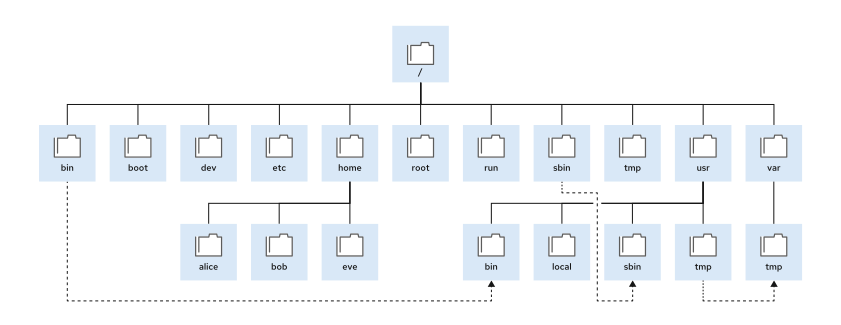

# File system hierarchy 

# Description
In GNU/Linux Systems there is a common structure for all distros, and they have their own purpose: binaries, home directory, and configuration files.

| Directory | Purpose                                                                                                                                                                                                                                                     |
| --------- | ----------------------------------------------------------------------------------------------------------------------------------------------------------------------------------------------------------------------------------------------------------- |
| /         | Root directory                                                                                                                                                                                                                                              |
| /bin      | System binaries used by system users or programs                                                                                                                                                                                                            |
| /boot     | Executed files at boot time                                                                                                                                                                                                                                 |
| /dev      | Special files used to access the hardware                                                                                                                                                                                                                   |
| /etc      | (editable text configuration) Configuration files                                                                                                                                                                                                           |
| /home     | Here resides the home directories of all users in the system                                                                                                                                                                                                |
| /root     | Home directory of root user                                                                                                                                                                                                                                 |
| /run      | Runtime execution data of processes, stored since the first boot time, it contains: - Process id files - Lock files The content of the directory is recreated in each boot time and stores consolidated data at /var/run and /var/lock directories |
| /tmp      | Temporal files, those that are not accessed, modified or changed are deleted automatically. In the /var/tmp directory applies the same rule, but it is executed each 30 days.                                                                               |
| /usr      | Installed software, shared libraries, including files, and read only data for programas.  Important sub-directories: - /usr/bin: common user commnads. - /usr/sbin: common user root commands. - /usr/local/: software locally customed.        |
| /var      | Specified variables in the system that persists across boots, databases, log files and static web pages content.                                                                                                                                            |
